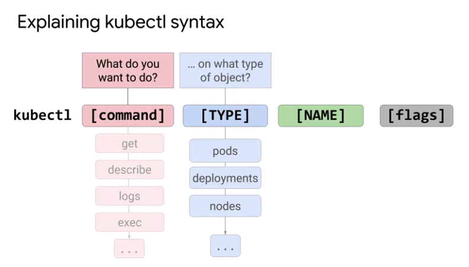

# GKE course on coursera
Architecting with GKE
https://www.coursera.org/learn/foundations-google-kubernetes-engine-gke

# kubectl command



```buildoutcfg

# verify kubecl config at ~/.kube/config
kubectl config view

# create cluster
gcloud container clusters create <cluster-name> \
--num-nodes 3 --zone <zone> --enable-ip-alias

# create cluster with autoscaling enabled
gcloud container clusters create <cluster-name> \
--num-nodes 30 --enable-autoscaling --min-nodes 15 -max-nodes 50 --zone <zone>

# add node-pool with autoscaling enabled
gcloud container node-pools create <pool-name> --cluster <cluster-name> \
--enable-autoscaling --min-nodes 15 -max-nodes 50 --zone <zone>

# enable autoscaling for existing node-pool
gcloud container clusters update <cluster-name> \
--enable-autoscaling --min-nodes 1 -max-nodes 5 --zone <zone> --node-pool <pool-name>

# disable autoscaling for existing node-pool
gcloud container clusters update <cluster-name> \
--no-enable-autoscaling --node-pool <pool-name> --zone <zone> --project <project-id>

# resize cluster
gcloud container clusters resize <cluster-name> --zone <zone> --size=4
gcloud container clusters resize <cluster-name> --node-pool <pool-name> --size=6

# authenticate kubectl with cluster
gcloud container clusters get-credentials <cluster-name> --zone=<zone>

# get cluster details
kubectl get cluster-info

# print out active kubectl context
kubectl config current-context
# print out all kubectl contexts
kubectl config get-contexts
# change kubectl context
kubectl config use-context <context-name>

# check resource utilization across nodes/pods
kubectl top nodes
kubectl top pods

# enable bash autocompletion for kubectl
source <(kubectl completion bash)

# port forward pod to localhost
kubectl port-forward <pod-name> 10081:80

# get logs from pod
kubectl logs <pod_name> -f --timestamps

# get pod/pods details
kubectl get pods
kubectl get pod [POD-NAME] -o=yaml
kubectl get pod [POD-NAME] -o=wide

kubectl exec [POD-NAME] [COMMAND]
kubectl exec demo ps aux

# run command within pod/container
kubectl exec -it [POD-NAME] [COMMAND]
kubect exec -it demo -- /bin/bash
kubect exec -it demo -c nginx -- /bin/bash

# deploy pod in demo namespace
kubectl create namespace demo
kubectl -n demo apply -f mypod.yaml
kubectl get namespace
kubectl get pods --namespace=test

```

# Deployments

```bash

# create deployment
kubectl apply -f <deployment-file>

kubectl run <deployment-name> \
--image <image>:<tag> \
--replicas 3 \
--labels <key>=<value> \
--port 8080 \
--generator deployment/apps.v1 \
--save-config

# inspect deployment
kubectl get/describe deployment <deployment-name>

# output deployment config in yaml format
kubectl get deployment <deployment-name> -o yaml > deployment.yaml

# scale deployment
kubectl scale deployment <deployment-name> --replicas=5

# autoscaling deployment (horizontal pod auto scaling) 
kubectl autoscale deployment <deployment-name> --min=2 --max=5 --cpu-percent=60

# inspect horizontal pod autoscaling
kubectl get hpa
kubectl describe horizontalpodautoscaler <deployment-name>

# update deployment
kubectl apply -f <deployment-file>
kubectl set image deployment <deployment-name> <image> <image>:<tag>
kubectl edit deployment/<deployment-name>

# update deployment via rolling updates, blue/green or canary deployments or replace deployments

# rollback deployment to previous version
kubectl rollout undo deployment <deployment-name>
# rollback deployment to specific previous version
kubectl rollout undo deployment <deployment-name> --to-revision=2
# inspect rollout history
kubectl rollout history deployment <deployment-name>
kubectl rollout history deployment <deployment-name> --revision=2

# pause/resume/status deployment
kubectl rollout pause deployment <deployment-name>
kubectl rollout resume deployment <deployment-name>
kubectl rollout status deployment <deployment-name>

kubectl delete deployment <deployment-name>     # delete deployment


# trigger a rolling update
kubectl set image deployment.v1.apps/nginx-deployment nginx=nginx:1.9.1 --record

```

# service

```bash
kubectl expose deployment <deployment-name> --target-port=8080 --type=NodePort

```

# taint

Taints allow a node to repel Pods.

```bash
# taint a node
kubectl taint nodes <node-name> key=value:NoSchedule
```

You can configure nodes to tolerate taints.
