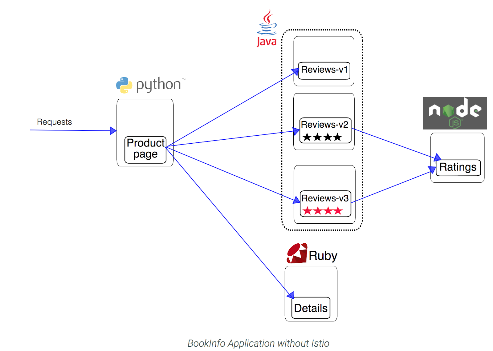

# Istio

This example deploys a sample application (Bookinfo) composed of four separate microservices used to demonstrate various Istio features.



More details about the Bookinfo app on the Istio website: https://istio.io/docs/examples/bookinfo/

All deployment steps detailed at: https://www.qwiklabs.com/focuses/616?parent=catalog

```bash

# define variables
my_zone=europe-west1-c

# set the default compute zone
gcloud config set compute/zone $my_zone

# create a new cluster
gcloud container clusters create hello-istio --num-nodes 4

# grant admin permissions in the cluster to the current gcloud user:
kubectl create clusterrolebinding cluster-admin-binding \
    --clusterrole=cluster-admin \
    --user=$(gcloud config get-value core/account)

# download Istio
curl -L https://git.io/getLatestIstio | ISTIO_VERSION=0.5.1 sh -

# add the istioctl client to your PATH:
cd ./istio-*
export PATH=$PWD/bin:$PATH

# install Istio
kubectl apply -f install/kubernetes/istio-auth.yaml

# ensure the following Kubernetes services are deployed: istio-pilot, istio-mixer, and istio-ingress.
kubectl get svc -n istio-system

# make sure that the corresponding Kubernetes pods are deployed and all containers are up by running:
kubectl get pods -n istio-system

# app described here
cat samples/bookinfo/kube/bookinfo.yaml

# generate yaml with Istio server included
istioctl kube-inject -f samples/bookinfo/kube/bookinfo.yaml

# take the output from istioctl kube-inject and feed it directly to kubectl to create the objects with their sidecars:
kubectl apply -f <(istioctl kube-inject -f samples/bookinfo/kube/bookinfo.yaml)

# confirm that the application has been deployed correctly by running the following commands:
kubectl get services
kubectl get pods
kubectl get ingress

export GATEWAY_URL=<your ingress IP>

# check that the BookInfo app is running with curl:
curl -o /dev/null -s -w "%{http_code}\n" http://${GATEWAY_URL}/productpage

```
# Istio static routing

Point your browser to http://$GATEWAY_URL/productpage to see the BookInfo web page
Refresh the page several times. Notice how you see three different versions of reviews! If you refer back to the diagram, you will see there are three different book review services which are being called in a round-robin style - no stars, black stars, and red stars. This is normal Kubernetes balancing behavior.
Istio can also be used to control which users are routed to which version of the services.

```bash

# confirm that there are no route rules installed
istioctl get routerules

# install rules for all available services
istioctl create -f samples/bookinfo/kube/route-rule-all-v1.yaml

# confirm that four rules were created
istioctl get routerules

```

# Istio dynamic routing

Go back to the BookInfo application (http://$GATEWAY_URL/productpage) in your browser. 
Refresh a few times. Do you see any stars? You should see the book review with no rating stars because the service reviews:v1 does not have any stars.

```bash

# create rule to route requests based on cookies
istioctl create -f samples/bookinfo/kube/route-rule-reviews-test-v2.yaml

# list the rules
istioctl get routerule
istioctl get routerule reviews-test-v2 -o yaml

```

Log in as user "jason" on the product page web page by clicking the Sign in button at the top of the screen, typing jason as the user name - you don't need a password - then clicking Sign in.

Refresh the browser. You should now see black ratings stars next to each review.

If you try logging in as any other user (log out as Jason and sign in as Kylie), or don't log in at all, you will continue to see reviews: v1

Run these commands to remove the routing rules:
```bash
istioctl delete -f samples/bookinfo/kube/route-rule-all-v1.yaml
istioctl delete -f samples/bookinfo/kube/route-rule-reviews-test-v2.yaml
```
